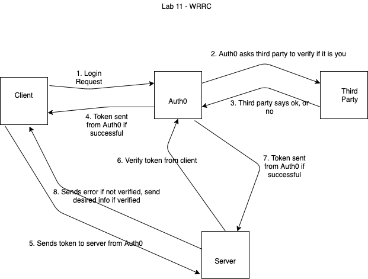

# Can of Books App (back-end)

**Author**: Ayrat Gimranov, Jamison McGrath (Brutal)
**Version**: 1.0.3

## Overview
<!-- Provide a high level overview of what this application is and why you are building it, beyond the fact that it's an assignment for this class. (i.e. What's your problem domain?) -->
In this module, we added Mongo DataBase so that a user can retrieve books stored in it.

## Getting Started
<!-- What are the steps that a user must take in order to build this app on their own machine and get it running? -->
- set up fron-end and back-end
- hook the front-end up to Auth0 using Auth0 docs
- hopp the back-end up to Auth0 to verify tokens received from front-end
- wire up front and back-end to complete the cycle;
- connect to Mongo database

## Architecture
<!-- Provide a detailed description of the application design. What technologies (languages, libraries, etc) you're using, and any other relevant design information. -->

This app uses HTML, CSS, JS, React, React-Bootstrap, Node.js (express), MongoDB, OAuth-Auth0, Trello.  

## Change Log
<!-- Use this area to document the iterative changes made to your application as each feature is successfully implemented. Use time stamps. Here's an example:

01-01-2001 4:59pm - Application now has a fully-functional express server, with a GET route for the location resource. -->
8/15/2021 - Bsaic repo set up done.
8/16/2021 - App receives the token from auth0, sends a test request to server which verifies the token with auth0 and returns the user info to front-end.

## Credit and Collaborations
<!-- Give credit (and a link) to other people or resources that helped you build this application. -->
Jamison McGrath (Brutalism) - team member,
Heather Bisgaard - shared [UML](./img/Lab11WRRC.png), helped in starting the repos setup
Clarissa Pamonicutt - helped set up basic repo

## Time Estimates

Name of feature: 1. Storage: As a user, I'd like my books to persist, so that whenever I make changes, I can see my full list of best books.

Estimate of time needed to complete: 2 hrs

Start time: 7.30 am

Finish time: 2.20 pm

Actual time needed to complete:  4 hrs

---------------------------------

Name of feature: 2. Book Component: As a user, I'd like to see my list of books, so that I can track what's impacted me, and what's recommended to me.

Estimate of time needed to complete: 2 hrs

Start time: 2.20 pm

Finish time:  5 pm

Actual time needed to complete:  2 hrs 40 mins
